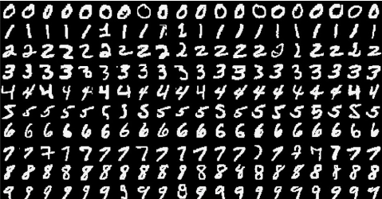

# Deep Learning

Este es un ejemplo de reconocimiento de digitos usando [MNIST](http://yann.lecun.com/exdb/mnist/) y Tensorflow. 



Para ejecutar el notebook:

```bash
git clone https://github.com/gersongams/DeepLearning
cd DeepLearning
jupyter notebook
```

Tambien puede visualizarlo desde [aquí](http://nbviewer.jupyter.org/github/gersongams/DeepLearning/blob/master/Digit%20Recognition%20using%20Tensorflow.ipynb). 

## Autor
* [@gersongams](https://github.com/gersongams)


